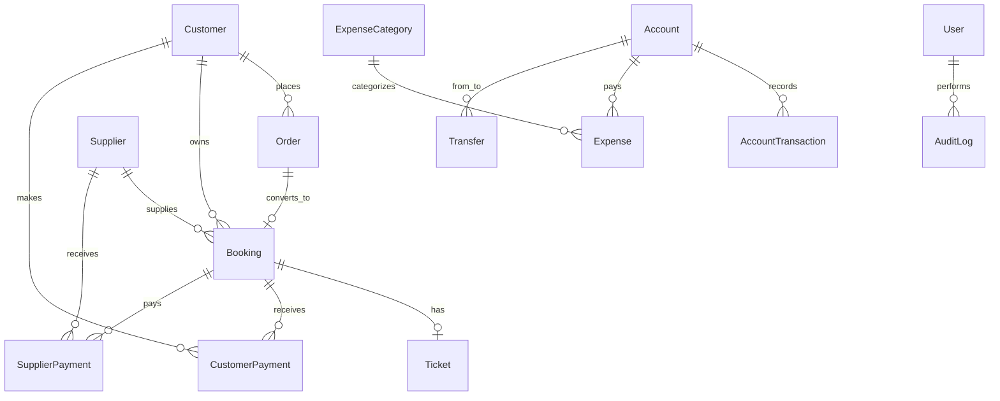

# Database Schema Reference

All collections use MongoDB via Mongoose. Timestamps (`createdAt`, `updatedAt`) are enabled unless noted.

---

## 1. users

Staff accounts for admin panel access.

| Field | Type | Notes |
|-------|------|-------|
| name | String | Required |
| email | String | Unique, lowercase |
| phone | String | Optional |
| password | String | bcrypt hashed, select: false |
| role | Enum | `admin`, `accountant`, `executive` |
| roleRef | ObjectId → Role | Optional FK |
| isActive | Boolean | Default true |
| lastLoginAt | Date | |
| lastActivityAt | Date | Inactivity timeout |
| passwordChangedAt | Date | JWT invalidation |
| createdBy | ObjectId → User | |

**Indexes:** `{ role, isActive }`

---

## 2. roles

Permission definitions per role (seeded).

| Field | Type | Notes |
|-------|------|-------|
| name | Enum | Unique role key |
| label | String | Display name |
| permissions | [String] | Permission keys |
| isActive | Boolean | |

---

## 3. customers

| Field | Type | Notes |
|-------|------|-------|
| name | String | Required |
| phone | String | Required, indexed |
| email | String | |
| address, nid, passportNo | String | |
| tags | [String] | |
| notes | String | |
| totalDue | Number | Denormalized aggregate |
| totalPaid | Number | Denormalized aggregate |
| totalSales | Number | Denormalized aggregate |
| isActive | Boolean | |
| createdBy | ObjectId → User | |

**Indexes:** Text on name, phone, email

---

## 4. suppliers

| Field | Type | Notes |
|-------|------|-------|
| name | String | Required |
| company, phone, email, address | String | |
| contactPerson | String | |
| type | Enum | agent, supplier, airline_office, other |
| notes | String | |
| totalPayable | Number | Denormalized |
| totalPaid | Number | Denormalized |
| isActive | Boolean | |
| createdBy | ObjectId → User | |

---

## 5. orders

Booking inquiries and manual orders.

| Field | Type | Notes |
|-------|------|-------|
| orderNumber | String | Unique, auto-generated |
| customer | ObjectId → Customer | Optional until linked |
| customerName, customerPhone, customerEmail | String | Snapshot fields |
| source | Enum | website, phone, whatsapp, walk_in |
| status | Enum | inquiry → closed/cancelled |
| journeyType | Enum | one_way, round_trip, multi_city |
| fromDestination, toDestination | String | |
| journeyDate, returnDate | Date | |
| passengerCount | Number | Min 1 |
| travelClass | Enum | economy … first |
| quotedSalePrice | Number | Optional quote |
| requestNotes, internalNotes | String | |
| followUpNotes | [{ note, nextFollowUpDate, createdBy, createdAt }] | |
| nextFollowUpDate | Date | Indexed |
| websiteBookingId | String | External ref |
| isFromWebsite | Boolean | |
| assignedTo, createdBy | ObjectId → User | |
| closedAt, cancelledAt, cancelReason | | |

**Indexes:** `{ status, nextFollowUpDate }`, `{ createdAt: -1 }`, `{ customerPhone }`

---

## 6. bookings

Confirmed ticket sales linked to orders.

| Field | Type | Notes |
|-------|------|-------|
| bookingNumber | String | Unique |
| order | ObjectId → Order | Required |
| customer | ObjectId → Customer | Required |
| supplier | ObjectId → Supplier | |
| airline, route, sector | String | |
| departureDate, returnDate | Date | |
| passengerCount | Number | |
| pnr, ticketNumber | String | |
| purchasePrice, salePrice, directCosts | Number | |
| profit | Number | **Auto-calculated on save** |
| amountPaid | Number | Customer payments received |
| customerDue | Number | **Auto-calculated** |
| supplierPayable, supplierPaid | Number | |
| paymentStatus | Enum | unpaid, partial, paid |
| supplierPaymentStatus | Enum | unpaid, partial, paid |
| status | Enum | draft → completed/cancelled |
| statusTimeline | [{ status, note, changedBy, changedAt }] | |
| ticket | ObjectId → Ticket | |
| notes | String | |
| createdBy | ObjectId → User | |
| deliveredAt, completedAt | Date | |

**Formula:** `profit = salePrice - purchasePrice - directCosts`

---

## 7. tickets

Uploaded ticket documents.

| Field | Type | Notes |
|-------|------|-------|
| booking | ObjectId → Booking | Unique (1:1) |
| pnr, ticketNumber, airline | String | |
| passengerNames | [String] | |
| filePath, fileName, mimeType, fileSize | | Multer upload |
| issuedAt | Date | |
| uploadedBy | ObjectId → User | |

---

## 8. accounts

Four system accounts (seeded).

| Field | Type | Notes |
|-------|------|-------|
| name | String | e.g. "Cash in Hand" |
| type | Enum | cash, bank, bkash, nagad — **unique** |
| accountNumber, bankName, mobileNumber | String | |
| openingBalance | Number | |
| currentBalance | Number | Updated on every transaction |
| isActive | Boolean | |
| lastClosingDate, lastClosingBalance | Date/Number | Daily closing |

---

## 9. account_transactions

Master ledger — every financial movement.

| Field | Type | Notes |
|-------|------|-------|
| transactionNumber | String | Unique |
| type | Enum | customer_payment, supplier_payment, expense, transfer_out, transfer_in, opening_balance, adjustment, refund |
| account | ObjectId → Account | Primary account |
| relatedAccount | ObjectId → Account | For transfers |
| amount | Number | Positive value |
| balanceAfter | Number | Snapshot after txn |
| transactionDate | Date | |
| paymentMethod, referenceNumber, notes | String | |
| order, booking, customer, supplier, expense, transfer | ObjectId | Polymorphic refs |
| customerPayment, supplierPayment | ObjectId | |
| createdBy | ObjectId → User | Required |

**Indexes:** `{ account, transactionDate: -1 }`, `{ type }`

---

## 10. customer_payments

| Field | Type | Notes |
|-------|------|-------|
| paymentNumber | String | Unique |
| customer | ObjectId | Required |
| booking, order | ObjectId | Optional link |
| account | ObjectId → Account | Where money received |
| amount | Number | Min 0.01 |
| paymentDate | Date | |
| paymentMethod, referenceNumber, notes | String | |
| status | Enum | unpaid, partial, paid |
| createdBy | ObjectId → User | |

**Side effect:** Creates credit `AccountTransaction`, updates account balance, booking.amountPaid, customer totals.

---

## 11. supplier_payments

Same structure as customer payments but debits account and reduces supplier payable.

---

## 12. expense_categories

Seeded with 12 default categories. `isSystem: true` prevents deletion.

---

## 13. expenses

| Field | Type | Notes |
|-------|------|-------|
| expenseNumber | String | Unique |
| category | ObjectId → ExpenseCategory | |
| title | String | |
| amount | Number | |
| expenseDate | Date | |
| account | ObjectId → Account | Paid from |
| billFilePath, billFileName | String | Optional upload |
| isRecurring | Boolean | |
| recurringTemplate | ObjectId → Expense | Self-ref |
| recurringFrequency | Enum | daily, weekly, monthly, yearly |
| nextDueDate | Date | For reminders |
| createdBy | ObjectId → User | |

---

## 14. transfers

Inter-account movements (cash ↔ bank ↔ bKash ↔ Nagad).

| Field | Type | Notes |
|-------|------|-------|
| transferNumber | String | Unique |
| fromAccount, toAccount | ObjectId → Account | |
| amount | Number | |
| transferDate | Date | |
| referenceNumber, notes | String | |
| createdBy | ObjectId → User | |

**Side effect:** Two `AccountTransaction` records (transfer_out + transfer_in).

---

## 15. reminders

| Field | Type | Notes |
|-------|------|-------|
| type | Enum | customer_due, booking_travel, supplier_payable, recurring_expense, manual_task |
| title, message | String | |
| dueDate | Date | |
| status | Enum | pending, sent, completed, dismissed |
| priority | Enum | low, medium, high |
| customer, supplier, booking, order, expense | ObjectId | Context links |
| assignedTo, createdBy, completedBy | ObjectId → User | |

---

## 16. cms_pages

| Field | Type | Notes |
|-------|------|-------|
| pageKey | Enum | home, about, services, contact, faq, booking |
| title, slug | String | slug unique |
| content | Mixed | JSON blocks |
| sections | [Mixed] | Homepage sections |
| isPublished | Boolean | |
| seo | { metaTitle, metaDescription, metaKeywords, ogImage } | |
| updatedBy | ObjectId → User | |

---

## 17. cms_notices

FAQ items, notices, offers.

| Field | Type | Notes |
|-------|------|-------|
| title, content | String | |
| type | Enum | notice, offer, faq, announcement |
| isPublished, isPinned | Boolean | |
| publishDate, expireDate | Date | |
| sortOrder | Number | |

---

## 18. settings

Singleton company configuration (`key: 'company'`).

Includes company info, logo path, social links, document number prefixes.

---

## 19. backup_logs

MongoDB backup history (scheduled + manual).

---

## 20. audit_logs

CRUD and security events with optional `changes` diff.

---

## 21. login_logs

Success/failure login attempts with IP and user agent.

---

## Relationship Diagram

## Number Generation Strategy (Phase 2+)

| Entity | Format | Example |
|--------|--------|---------|
| Order | `{prefix}-{YYYYMM}-{seq}` | ORD-202506-0001 |
| Booking | `{prefix}-{YYYYMM}-{seq}` | BKG-202506-0042 |
| Payment | `CP-{YYYYMM}-{seq}` / `SP-{YYYYMM}-{seq}` | CP-202506-0015 |
| Expense | `EXP-{YYYYMM}-{seq}` | EXP-202506-0003 |
| Transfer | `TRF-{YYYYMM}-{seq}` | TRF-202506-0007 |
| Transaction | `TXN-{YYYYMM}-{seq}` | TXN-202506-0100 |

Sequences stored in `settings` or dedicated counter collection.
