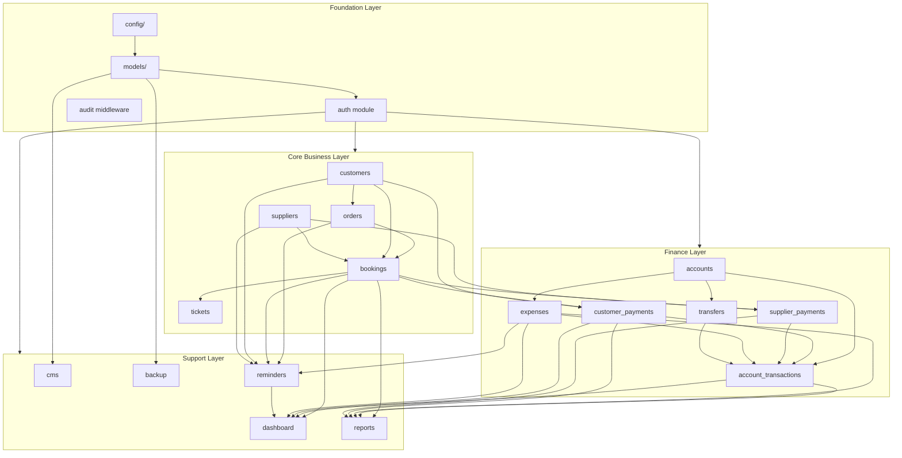

# Module Dependency Map

This document defines build order, runtime dependencies, and shared services between modules.

---

## Dependency Graph



---

## Phase Build Order

```
Phase 1: config, models, routes (stubs), permissions, seeds
    ↓
Phase 2: auth → audit middleware → dashboard (read-only aggregates)
         → public API → frontend shells
    ↓
Phase 3: customers, suppliers → orders → bookings → tickets
    ↓
Phase 4: accounts → ledger service → payments → expenses → transfers
    ↓
Phase 5: reminders (cron) → reports → CMS admin → backup (cron) → security
    ↓
Phase 6: deploy configs
```

---

## Shared Services (Phase 2+)

| Service | File | Used By |
|---------|------|---------|
| `ledgerService` | `services/ledger.service.js` | payments, expenses, transfers, accounts |
| `numberGenerator` | `services/numberGenerator.service.js` | orders, bookings, payments, expenses |
| `bookingService` | `services/booking.service.js` | bookings, payments, dashboard, reports |
| `customerService` | `services/customer.service.js` | customers, orders, payments |
| `supplierService` | `services/supplier.service.js` | suppliers, bookings, payments |
| `auditService` | `services/audit.service.js` | all write operations |
| `uploadService` | `services/upload.service.js` | tickets, expenses, CMS logo |
| `reportService` | `services/report.service.js` | reports module |
| `reminderService` | `services/reminder.service.js` | reminders cron, dashboard alerts |
| `backupService` | `services/backup.service.js` | backup cron, admin trigger |

---

## Critical Service: ledgerService

Central to all financial modules. Must use MongoDB transactions.

```
recordCustomerPayment(data)
  1. Validate account, customer, booking
  2. Start session/transaction
  3. Create CustomerPayment document
  4. Increment Account.currentBalance
  5. Create AccountTransaction (type: customer_payment)
  6. Update Booking.amountPaid, paymentStatus, customerDue
  7. Update Customer.totalPaid, totalDue
  8. Commit transaction
  9. Write AuditLog

recordSupplierPayment(data)
  → Mirror flow with balance DECREASE

recordExpense(data)
  → Decrease account balance

recordTransfer(data)
  → Decrease fromAccount, increase toAccount
  → Two AccountTransaction records linked to Transfer
```

**Dependency rule:** No module may update `Account.currentBalance` directly except `ledgerService`.

---

## Module Interaction Table

| Module | Depends On | Provides To |
|--------|------------|-------------|
| **Auth** | User, Role, LoginLog | All protected routes |
| **Customers** | User (createdBy) | Orders, Bookings, Payments, Reminders, Reports |
| **Suppliers** | User | Bookings, Payments, Reminders, Reports |
| **Orders** | Customer (optional), User | Bookings, Reminders, Dashboard |
| **Bookings** | Order, Customer, Supplier, User | Ticket, Payments, Dashboard, Reports, Reminders |
| **Tickets** | Booking, Upload | Bookings (status update) |
| **Accounts** | Seed data | Ledger, Payments, Expenses, Transfers, Dashboard |
| **Customer Payments** | Customer, Booking, Account, ledgerService | Customer totals, Dashboard, Reports |
| **Supplier Payments** | Supplier, Booking, Account, ledgerService | Supplier totals, Dashboard, Reports |
| **Expenses** | ExpenseCategory, Account, ledgerService | Dashboard, Reports, Reminders |
| **Transfers** | Account (×2), ledgerService | Account statements |
| **Dashboard** | Orders, Bookings, Accounts, Payments, Expenses, Reminders | Admin UI home |
| **Reminders** | Customer, Supplier, Booking, Order, Expense + cron | Dashboard alerts |
| **Reports** | All finance + booking modules | Admin UI exports |
| **CMS** | Setting, CmsPage, CmsNotice, Upload | Public website |
| **Backup** | MongoDB, BackupLog + cron | Admin settings |
| **Audit** | User, AuditLog | All write endpoints |

---

## Frontend Module Dependencies

```
AuthContext
  └── ProtectedRoute (checks login + permission)
        └── Layout (Sidebar filtered by role)
              ├── DashboardPage → dashboard API
              ├── OrdersPage → orders API + customers lookup
              ├── BookingsPage → bookings API + orders, suppliers
              ├── CustomersPage → customers API
              ├── SuppliersPage → suppliers API
              ├── AccountsPage → accounts API
              ├── PaymentsPage → payments API + accounts, customers/suppliers
              ├── ExpensesPage → expenses API + accounts, categories
              ├── RemindersPage → reminders API
              ├── ReportsPage → reports API
              └── CmsPage → cms API
```

### Shared Frontend Components (build in Phase 2)

| Component | Used In |
|-----------|---------|
| `DataTable` (TanStack) | All list pages |
| `StatCard` | Dashboard |
| `DateRangeFilter` | Reports, ledgers, expenses |
| `AccountSelect` | Payments, expenses, transfers |
| `CustomerSelect` | Orders, bookings, payments |
| `SupplierSelect` | Bookings, supplier payments |
| `StatusBadge` | Orders, bookings |
| `CurrencyDisplay` | All financial views (BDT) |
| `ConfirmDialog` | Delete, cancel actions |
| `FileUpload` | Tickets, expenses, logo |

---

## Cron Job Dependencies (Phase 5)

| Job | Schedule | Triggers | Creates |
|-----|----------|----------|---------|
| `dailyBackup` | 02:00 daily | backupService | BackupLog |
| `customerDueReminders` | 09:00 daily | bookings with customerDue > 0 | Reminder |
| `travelDateReminders` | 09:00 daily | bookings departing in 2 days | Reminder |
| `supplierPayableReminders` | 09:00 Mon | bookings with supplierPayable > 0 | Reminder |
| `recurringExpenseReminders` | 09:00 daily | expenses with nextDueDate | Reminder |
| `generateRecurringExpenses` | 00:05 daily | recurring templates | Expense |

---

## Data Flow: Website Booking → Ticket Delivery

```
1. Customer submits /public/booking-requests
2. Order created (source: website, status: inquiry)
3. Executive imports/views order → status: quoted
4. Executive creates Booking from Order
5. Customer record linked/created
6. Status: pending_purchase → Executive assigns Supplier
7. Accountant/Admin records supplier purchase → status: purchased
8. Ticket uploaded → status: ticket_added
9. Customer payment recorded (partial or full) → account balance ↑
10. Supplier payment recorded → account balance ↓
11. Ticket delivered to customer → status: delivered → closed
12. Profit visible in booking + reports
13. Reminders auto-generated at steps 6, 9, 11
```

---

## Testing Priority by Dependency

1. `ledgerService` unit tests (balance integrity)
2. Booking profit calculation
3. Partial payment → status transitions
4. Transfer double-entry correctness
5. Permission middleware per route
6. Order → Booking conversion

---

## External Dependencies

| Package | Module |
|---------|--------|
| mongoose | All models |
| bcryptjs | Auth |
| jsonwebtoken + cookie-parser | Auth |
| multer | Tickets, Expenses, CMS |
| node-cron | Reminders, Backup, Recurring expenses |
| pdfkit | Report PDF export |
| zod | All validators |
| dayjs | Dates (frontend + backend) |
| recharts | Dashboard, Reports (frontend) |
| @tanstack/react-table | All admin tables (frontend) |
